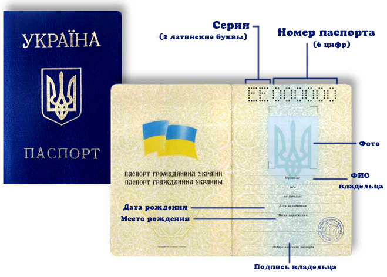

# Домашні завдання

## 29.06.2023

Взяти за основу `WebApplicationDemo`, та оформити належним чином зовнішній вигляд сторінок. Використовуючи [`Bootstrap`](https://getbootstrap.com/docs/5.3/getting-started/introduction/), замінити посилання на піктограми з показом підказок. Перетворити сторінку видалення у [`Modal`](https://getbootstrap.com/docs/5.3/getting-started/introduction/). Перенести зі сторінки видалення `OnPost` в `Index` як `OnPostDelete`.

## 11.07.2023

Взяти за основу `WebApplicationDemo`. Створити сторінку редагування ролей(`Administrator` - наперед визначена роль без права редагування). Створити сторінку редагування, створення користувачів та призначення користувачам ролей(наперед визначити одного з адміністраторів) з можливістю змінення паролю.

## 10.08.2023

Взяти за основу `WebApplicationDemo`. Провести повну локалізацію проекту українською мовою та додати можливість перемикати мови. Як основну мову використати англійську.

## 15.08.2023

Взяти за основу `WebApplicationDemo`. Провести повну локалізацію `Areas/Identity/Pages/Account` (за виключенням папки `Manage`) українською мовою. Як основну мову використовувати англійську. Видалити або сховати додаткову інформацію від Microsoft на сторінках `Identity`.

## 17.08.2023 Classwork / Homework

Взяти за основу `WebApplicationDemo`.

1. Додати модель `Client` з полями:

	- `Name`(швидке для пошуку ім’я) обов’язкове для заповнення;

	- `FullName`(повне найменування для офіційних документів) — необов’язкове;

	- `Code`([ЄДРПОУ(8 цифр)](https://uk.wikipedia.org/wiki/Код_ЄДРПОУ), [ДРФО(10 цифр)](https://uk.wikipedia.org/wiki/Державний_реєстр_фізичних_осіб_-_платників_податків), [номер паспорта(9 цифр)](https://uk.wikipedia.org/wiki/Паспорт_громадянина_України#Новий_паспорт_2016_року_\(ID-картка\))) — необов’язкове;

	- `Person`(`true` — фізична особа/`false` — юридична особа);

	- додаткові поля на ваш розсуд.

> Враховуйте, що для старих паспортів схема інакша. Ідентифікатор старого паспорта складається з серії(дві латинські літери) та номера паспорта(6 цифр). Серія та номер розділені пробілом. Загальний розмір строки, проте, той же — 9 символів.

2. Додати в `Identity` введення `Client` при реєстрації(якщо вказаний користувачем `Client` існує, пропонувати зв’язати з ним замість створення нового). У результаті при реєстрації має або бути створений новий `Client`, або підключений вже існуючий.

> **:warning: Завдання 3-4 виконувати тільки після виконання попередніх завдань.**